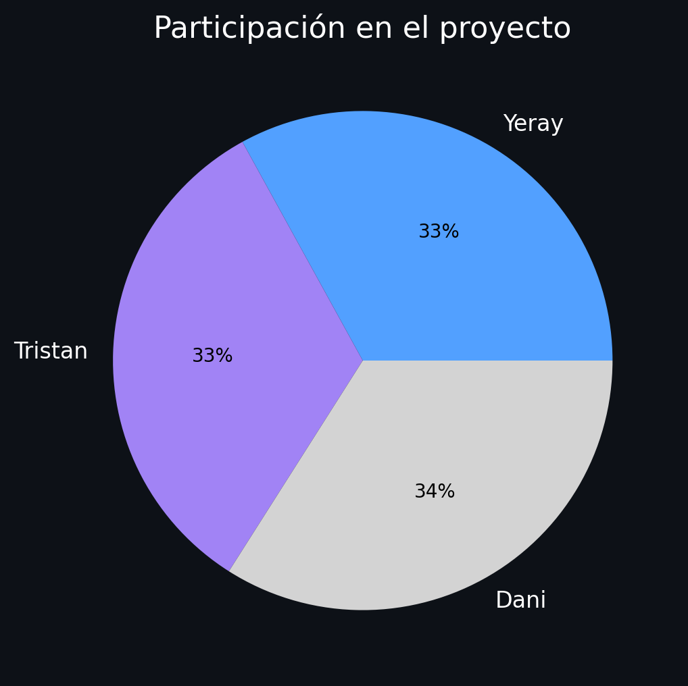

# TradeMind 📱💹

## Descripción del Proyecto 📚
TradeMind es una aplicación web que implementa una red multiagente especializada en la predicción y estudio de precios de trade-in de smartphones. Utilizando tecnologías avanzadas de IA y procesamiento de lenguaje natural, el sistema proporciona estimaciones precisas y recomendaciones personalizadas para usuarios interesados en la compra-venta de dispositivos móviles.

## Características Principales 🌟

### Sistema de Agentes Inteligentes 🤖
- **Detección de Intenciones**: Análisis automático de las necesidades del usuario
- **Evaluación de Dispositivos**: Sistema de clasificación por grados.
- **Predicción de Precios**: Estimaciones basadas en múltiples factores
- **Recomendaciones**: Sugerencias personalizadas según presupuesto y preferencias

### Interfaz de Usuario 💻
- Chat interactivo en tiempo real
- Visualización de datos y gráficos

## Tecnologías Utilizadas 🛠️

### Backend
- FastAPI
- LangGraph
- LangChain
- OpenAI GPT-4

### Frontend
- Angular 19
- Chart.js
- TailwindCSS
- TypeScript

## Estructura del Proyecto 📁

```
TradeMind/
├── server/                 # Backend FastAPI
│   ├── agent/             # Lógica de agentes
│   ├── main.py           # Servidor principal
│   └── requirements.txt   # Dependencias Python
│
└── client/                # Frontend Angular
    ├── src/              # Código fuente
    ├── angular.json      # Configuración Angular
    └── package.json      # Dependencias Node.js
```

## Instalación y Configuración 🔧

### Requisitos Previos
- Python 3.12+
- Node.js 19+
- API key de OpenAI
- API key de LangChain (opcional)

### Backend Setup

1. Crear entorno virtual:
```bash
cd server
python -m venv env
source env/bin/activate  # En Windows: env\Scripts\activate
```

2. Instalar dependencias:
```bash
pip install -r requirements.txt
```

3. Configurar variables de entorno:
```bash
cp .env_example .env
# Editar .env con tus API keys
```

4. Iniciar servidor:
```bash
uvicorn main:app --reload --port 8000
```

### Frontend Setup

1. Instalar dependencias:
```bash
cd client
npm install
```

2. Iniciar servidor de desarrollo:
```bash
ng serve
```

3. Acceder a la aplicación:
```
http://localhost:4200
```

## Uso del Sistema 📱

### Funcionalidades Principales

1. **Venta de Dispositivos**
   - Evaluación del estado del dispositivo
   - Estimación de precio de venta
   - Gráficos de depreciación

2. **Compra de Dispositivos**
   - Búsqueda por presupuesto
   - Recomendaciones personalizadas
   - Comparativas de precios

3. **Análisis de Mercado**
   - Gráficos de evolución de precios
   - Tendencias del mercado
   - Predicciones de depreciación

## Estado del Desarrollo 🚧
- [x] Sistema base de agentes
- [x] API REST funcional
- [x] Interfaz de chat
- [x] Evaluación de dispositivos
- [x] Predicción de precios
- [ ] Base de datos de dispositivos
- [ ] Sistema de usuarios
- [ ] PWA support

### Recursos utilizandos
Dado que los datos empleados en el entrenamiento de los modelos son propiedad de una empresa externa ([Aliqindoi](https://aliqindoi.com/)), no podemos compartirlos públicamente.

## Enlace video referencia
[Ver video](https://www.youtube.com/watch?v=aFz_R7vci3I)

## Licencia 📄
Este proyecto está bajo la Licencia MIT 

## Porcentajes de Contribución 📊

